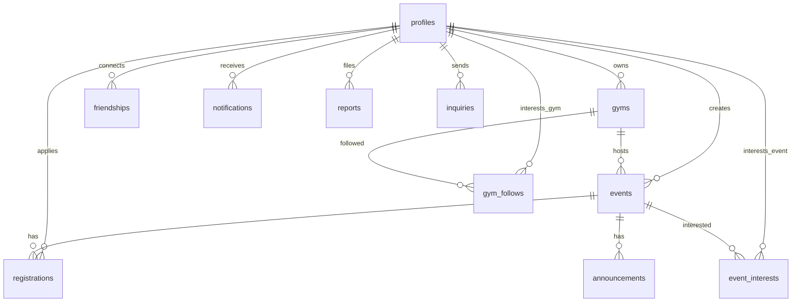

# OpenHouse Database Design

Supabase PostgreSQL 스키마 · RLS · 마이그레이션 가이드.

ERD 문서 이름과 실제 테이블 대응: **[ERD_V1.1_MAPPING.md](./ERD_V1.1_MAPPING.md)**

---

## Migration checklist

Supabase **SQL Editor**에서 `supabase/migrations/` 파일을 **번호 순서대로** 실행하세요.

| # | File | 내용 |
|---|------|------|
| 001 | `001_initial_schema.sql` | 기본 테이블, RLS |
| 002 | `002_profile_fields.sql` | 프로필 필드 |
| 003 | `003_signup_regions_sports.sql` | 지역·종목 |
| 004 | `004_age_and_signup.sql` | 나이·가입 |
| 005 | `005_parent_phone.sql` | 부모 연락처 |
| 006 | `006_nickname.sql` | 닉네임 |
| 007 | `007_nickname_unique.sql` | 닉네임 UNIQUE |
| 008 | `008_gym_representative.sql` | 체육관 대표 |
| 009 | `009_gym_profile.sql` | 체육관 프로필·사진 |
| 010 | `010_profile_bio_photo.sql` | 프로필 사진·자기소개 |
| 011 | `011_event_operator.sql` | 모집 마감·참가자 메모 |
| 012 | `012_event_type_notifications.sql` | 일정 유형·알림 |
| 013 | `013_gym_mvp_fields.sql` | 체육관 종목·연락처·시설 |
| 014 | `014_gym_facility_notes.sql` | 시설 안내 |
| 015 | `015_class_schedule.sql` | 수업 시간표 (jsonb) |
| 016 | `016_interview_features.sql` | 미리보기 RPC, 대련, 안전, **gym_follows** |
| 017 | `017_signup_trigger_fix.sql` | 가입 트리거 수정 |
| 018 | `018_signup_ensure.sql` | 가입 필수 컬럼 보장 |
| 019 | `019_sparring_nickname_preview.sql` | 대련 찾기 닉네임 미리보기 |
| 020 | `020_event_apply_host.sql` | 참가비·마감·난이도·신청 스냅샷 |
| 021 | `021_announcement_notifications.sql` | 공지→참가자 알림, 취소→호스트 알림 |
| 022 | `022_gym_profile_enrichment.sql` | 체육관 상세 필드 확장 |
| 023 | `023_gym_photo_categories.sql` | 사진 카테고리 |
| 024 | `024_gym_photo_captions.sql` | 사진 캡션 jsonb |
| 025 | `025_gym_representative_role.sql` | 담당자 직책 |
| 026 | `026_event_visit_info.sql` | 이벤트 방문·gi 안내 |
| 027 | `027_profile_social.sql` | **friendships**, 운동 사진 |
| 028 | `028_sparring_seeker_user_id.sql` | 대련 미리보기 user_id |
| 029 | `029_profile_visibility.sql` | **visibility_settings** |
| 030 | `030_party_registration.sql` | **동행 신청** (`party_id`, RPC) |
| 031 | `031_erd_mvp_completion.sql` | **reports**, **inquiries**, **event_interests**, 정원 lock, friendship unique |
| 032 | `032_host_cancel_registration.sql` | 관장 참가 취소 RPC (`update_registration_status`) |
| 033 | `033_pending_gym_info.sql` | 관장 가입 임시 체육관 정보 (`profiles.pending_gym_info`) |
| 034 | `034_event_registration_count_rpc.sql` | 공개 승인 인원 RPC (`get_event_registration_count`) |
| 035 | `035_event_registration_counts_rpc.sql` | 공개 승인 인원 배치 RPC (`get_event_registration_counts`) |
| 036 | `036_solo_registration_rpc.sql` | 혼자 참가 신청 RPC (`create_solo_registration`) |
| 037 | `037_fix_registration_capacity_trigger.sql` | 참가 insert 트리거 enum 오류 수정 |
| 038 | `038_registration_count_include_pending.sql` | 공개 인원 집계에 승인 대기(pending) 포함 |
| 039 | `039_host_registration_stats_rpc.sql` | 호스트 승인 대기·참가 집계 RPC |
| 040 | `040_event_auto_approve.sql` | 이벤트 자동 승인 |
| 041 | `041_event_address.sql` | 이벤트 주소 |
| 042 | `042_event_recurring_days.sql` | 반복 요일 |
| 043 | `043_event_time_required.sql` | 시작 시간 필수 |
| 044 | `044_participant_preview_gender.sql` | 참가자 미리보기 성별·목록 |
| 045 | `045_fix_registrations_party_rls_recursion.sql` | 동행 RLS 무한 재귀 수정 (**필수**) |
| 046 | `046_unify_registration_capacity.sql` | 정원 기준 통일 (pending + approved) |
| 047 | `047_profile_rls.sql` | 프로필 RLS 강화 + 공개 조회 RPC (**033 컬럼 포함, 047 적용 필요**) |

> `016_resume.sql`은 016 중단 시에만 사용. 정상 경로는 016 한 번 실행.

### 오류 예시와 대응

| 오류 | 대응 |
|------|------|
| `Could not find the 'bio' column` | **010** 미적용 |
| `Could not find the 'nickname' column` | **006** 미적용 |
| `Could not find the 'event_type' column` | **012** 미적용 |
| `event_interests` / `reports` 없음 | **031** 미적용 |
| `party_id` 없음 | **030** 미적용 |
| `infinite recursion detected in policy for relation "registrations"` | **045** 미적용 |
| `Could not find the function public.get_public_profile` | **047** 미적용 |
| `column "pending_gym_info" of relation "profiles" does not exist` | **033** 또는 **047** 재실행 (047 상단에 컬럼 추가 포함) |

---

## Core tables

### profiles

Supabase Auth 사용자 확장.

| Column | Notes |
|--------|-------|
| display_name | 실명 (호스트에게) |
| nickname | UNIQUE, 커뮤니티 표시 |
| gender, age, age_group | |
| experience, weight_class | 수련 배경·체급 |
| phone, parent_phone | 10대 부모 연락처 |
| regions[], preferred_sports[] | |
| photo_url, bio | |
| visibility_settings | jsonb (029+) |
| pending_gym_info | jsonb — 관장 가입 임시 체육관 (033+) |

### gyms

| Column | Notes |
|--------|-------|
| owner_id | → profiles (호스트) |
| name, sport, region, address | |
| photo_url, mat_photos, … | 카테고리별 사진 (023+) |
| class_schedule | jsonb |
| facilities[], facility_notes | |
| is_public | |

### events

| Column | Notes |
|--------|-------|
| gym_id, created_by | |
| title, description, event_type, sport, region | |
| event_date, event_time | |
| max_participants | capacity; NULL = 무제한 |
| recruitment_closed | 수동 마감 |
| fee_amount, registration_deadline, difficulty | 020+ |
| status | `active` / `cancelled` (031+) |

### registrations (Participation)

| Column | Notes |
|--------|-------|
| event_id, user_id | |
| status | pending, approved, rejected, cancelled |
| apply_weight_class, apply_experience, … | 신청 시 스냅샷 (020+) |
| party_id, party_representative_user_id | 동행 (030+) |
| seeking_sparring | 대련 찾기 (016+) |
| operator_memo | |

**Constraints**

- UNIQUE (event_id, user_id) for active (pending/approved)
- 정원: `pending + approved` 기준 (038 공개 집계, 046 auto_approve·트리거 통일)
- `check_event_capacity()` + `update_registration_status()` RPC (031+)

---

## MVP+ tables

### gym_follows (GymInterest)

| Column | Notes |
|--------|-------|
| user_id, gym_id | PK = UNIQUE pair |
| created_at | |

관심 체육관. **참가 정원과 무관.**

### event_interests (EventInterest) — 031+

| Column | Notes |
|--------|-------|
| user_id, event_id | PK = UNIQUE pair |
| created_at | |

관심 이벤트. **참가 정원과 무관.**

### friendships

| Column | Notes |
|--------|-------|
| requester_id, addressee_id | |
| status | pending, accepted, … |

031+: 양방향 중복 방지 unique index.

### reports — 031+

신고 (카테고리, 설명, status). 유저는 본인 신고만 조회.

### inquiries — 031+

1:1 문의. 유저는 본인 문의만 조회.

### notifications

앱 내 알림 (type, title, body, link, read_at).

### announcements

이벤트 공지.

---

## ER Diagram (core + MVP+)

---

## RLS summary

| Table | Public read | Insert | Update |
|-------|-------------|--------|--------|
| profiles | own + friends + host registrants; public/search via RPC (047+) | own (trigger) | own |
| gyms | public gyms | authenticated (owner=self) | owner |
| events | all active | gym owner | gym owner |
| registrations | own + event owner | self | own cancel / owner RPC |
| gym_follows | own | self | self delete (toggle) |
| event_interests | own | self | self delete (toggle) |
| friendships | participants | requester | participants |
| reports | own | self | — |
| inquiries | own | self | — |
| notifications | own | system/trigger | own read |
| announcements | all | gym owner | gym owner |

---

## Exception rules

1. **중복 신청**: 이벤트당 active registration 1건.
2. **정원**: `pending + approved` 합산 (046). insert 트리거 + auto_approve RPC + 공개 집계 RPC 동일 기준.
3. **관심 vs 참가**: GymInterest/EventInterest는 capacity에 영향 없음.
4. **동행**: accepted 친구만 `create_party_registration` (030+).
5. **공개 목록**: upcoming · active · 모집 중 이벤트만 (앱 레이어에서 추가 필터).
6. **공개 신청 인원**: `get_event_registration_count` / `get_event_registration_counts` RPC (038+) — pending + approved, RLS 우회 집계.

---

## Related docs

- [ERD_V1.1_MAPPING.md](./ERD_V1.1_MAPPING.md)
- [MVP-APPLY-HOST.md](./MVP-APPLY-HOST.md)
- [ROUTES.md](./ROUTES.md)
