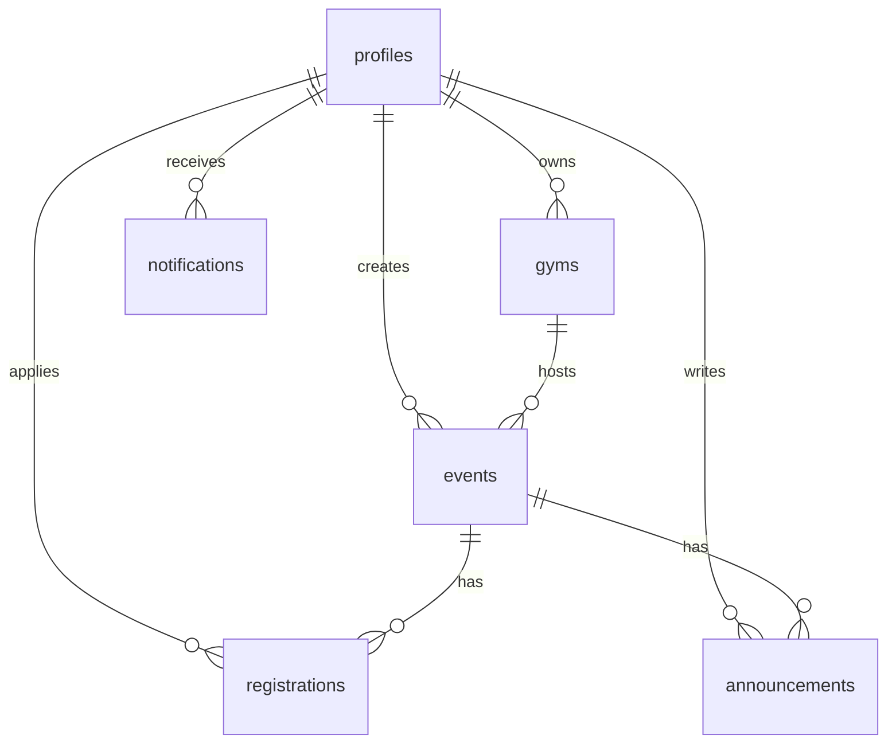

# OpenHouse MVP Database Design

## Migration checklist

Supabase **SQL Editor**에서 아래 파일을 **번호 순서대로** 실행하세요.

| # | File | 내용 |
|---|------|------|
| 001 | `001_initial_schema.sql` | 기본 테이블, RLS |
| 002 | `002_profile_fields.sql` | 프로필 필드 |
| 003 | `003_signup_regions_sports.sql` | 지역·종목 |
| 004 | `004_age_and_signup.sql` | 나이·가입 |
| 005 | `005_parent_phone.sql` | 부모 연락처 |
| 006 | `006_nickname.sql` | 닉네임 컬럼 |
| 007 | `007_nickname_unique.sql` | 닉네임 UNIQUE |
| 008 | `008_gym_representative.sql` | 체육관 대표 |
| 009 | `009_gym_profile.sql` | 체육관 프로필·사진 |
| 010 | `010_profile_bio_photo.sql` | 프로필 사진·자기소개 |
| 011 | `011_event_operator.sql` | 모집 마감·참가자 메모 |
| 012 | `012_event_type_notifications.sql` | 일정 유형·알림 |
| 013 | `013_gym_mvp_fields.sql` | 체육관 종목·연락처·시설 |
| 014 | `014_gym_facility_notes.sql` | 시설 안내 자유 입력 |
| 015 | `015_class_schedule.sql` | 수업 시간표 (jsonb) |

오류 예시와 대응:

- `Could not find the 'bio' column` → **010** 미적용
- `Could not find the 'nickname' column` → **006** 미적용
- `Could not find the 'event_type' column` → **012** 미적용

---

## Tables

### profiles
Extends Supabase Auth users.

| Column | Type | Notes |
|--------|------|-------|
| id | uuid PK | FK → auth.users |
| display_name | text | 실명 (이벤트 호스트에게만 공개) |
| nickname | text | 닉네임 (커뮤니티 공개, UNIQUE 대소문자 무시) |
| gender | text | 남성 / 여성 |
| age | integer | 가입 시 입력 (10~99, 본인만) |
| age_group | text | 관장에게 표시: 10대, 20대, 30대, 30+ |
| experience | text | 수련 배경: 엘리트 선수 / 일반 수련자 · 기간 |
| phone | text | 본인 연락처 (10대 필수, 그 외 선택) |
| parent_phone | text | 부모님 연락처 (10대 필수) |
| regions | text[] | 활동구역 (복수) |
| preferred_sports | text[] | 관심 스포츠 (복수) |
| photo_url | text | 프로필 사진 |
| bio | text | 자기소개 |
| created_at | timestamptz | |

### gyms
Registered by any logged-in user; owner becomes operator.

| Column | Type | Notes |
|--------|------|-------|
| id | uuid PK | |
| owner_id | uuid FK | → profiles |
| name | text NOT NULL | |
| sport | text NOT NULL | 종목 (유도 등) |
| region | text NOT NULL | 활동 지역 (시·군·구) |
| address | text NOT NULL | 상세 주소 |
| representative_name | text | 대표 이름 (회원가입 운영자 경로) |
| representative_phone | text | 대표 연락처 (회원가입 운영자 경로) |
| photo_url | text | 대표 사진 URL |
| description | text | 체육관 소개 (선택, MVP 폼 미사용) |
| phone | text | 전화번호 (선택) |
| instagram_url | text | 인스타그램 (선택) |
| homepage_url | text | 홈페이지 (선택) |
| sns_url | text | 레거시 SNS (instagram_url로 이전) |
| operating_hours | text | (레거시) 평일/주말 운영 시간 |
| class_schedule | jsonb | 수업 시간표 `[{ id, day, className, start, end }]` |
| closed_days | text | 휴관일 |
| facilities | text[] | 시설 체크박스 (`주차:무료` / `주차:유료` 포함) |
| facility_notes | text | 시설 안내 (선택) |
| is_public | boolean | 공개 여부 (기본 true) |
| created_at | timestamptz | |

### events

| Column | Type | Notes |
|--------|------|-------|
| id | uuid PK | |
| gym_id | uuid FK | → gyms |
| created_by | uuid FK | → profiles |
| title | text NOT NULL | |
| description | text | |
| event_type | text | open_mat, seminar, competition |
| sport | text NOT NULL | 종목 필터 |
| region | text NOT NULL | 지역 필터 |
| event_date | date NOT NULL | 날짜 필터 |
| event_time | time | |
| max_participants | int | NULL = unlimited |
| recruitment_closed | boolean | 수동 모집 마감 (default false) |
| created_at | timestamptz | |

### registrations

| Column | Type | Notes |
|--------|------|-------|
| id | uuid PK | |
| event_id | uuid FK | → events |
| user_id | uuid FK | → profiles |
| status | text | pending, approved, rejected, cancelled |
| operator_memo | text | 운영자 메모 |
| created_at | timestamptz | |

**Constraints**
- UNIQUE (event_id, user_id) for active statuses (pending, approved)
- Trigger blocks approved count ≥ max_participants

### announcements

| Column | Type | Notes |
|--------|------|-------|
| id | uuid PK | |
| event_id | uuid FK | → events |
| author_id | uuid FK | → profiles |
| content | text NOT NULL | |
| created_at | timestamptz | |

### notifications

| Column | Type | Notes |
|--------|------|-------|
| id | uuid PK | |
| user_id | uuid FK | → profiles |
| type | text | registration_pending, registration_approved, … |
| title | text NOT NULL | |
| body | text | |
| link | text | 앱 내 경로 |
| read_at | timestamptz | NULL = 미읽음 |
| created_at | timestamptz | |

## ER Diagram

## RLS Summary

| Table | Public read | Insert | Update | Delete |
|-------|-------------|--------|--------|--------|
| profiles | authenticated | own (trigger) | own | — |
| gyms | all | authenticated (owner=self) | owner | owner |
| events | all | gym owner | gym owner | gym owner |
| registrations | own + event gym owner | authenticated (self) | own cancel / owner manage | — |
| announcements | all | gym owner | gym owner | gym owner |
| notifications | own only | trigger (system) | own (read) | — |

## Exception Rules

1. **Duplicate application**: One active registration (pending/approved) per user per event.
2. **Capacity**: DB trigger rejects new approved when count ≥ max_participants.
3. **Approval flow**: pending → approved | rejected | cancelled; owner can revert approved → pending.
4. **Operator permission**: Gym owner_id manages events and participants.
5. **Public list**: Upcoming events only; excludes recruitment_closed and full-capacity events.
